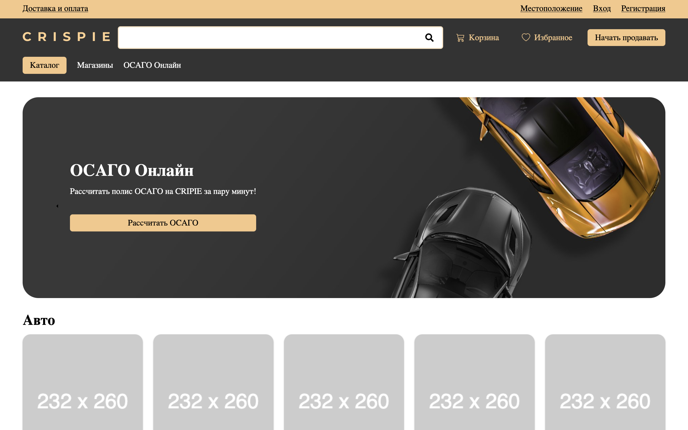
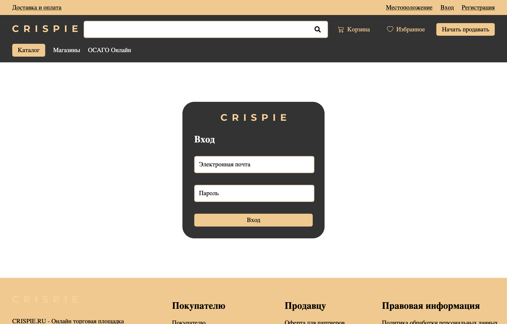

# Маркетплейс CRISPIE

Добро пожаловать в документацию проекта "CRISPIE Marketplace"! Это маркетплейс, который предназначен для объединения поставщиков с контрагентами (клиентами, дилерами, дистрибьюторами) в едином торговом пространстве. В этой документации вы найдете информацию о структуре проекта, его компонентах и основных функциях.

<div style="display: flex; align-items: center;">
    
    <hr style="color: white; height: 1px; flex-grow: 1; transform: rotate(-90deg);"/>
    
</div>


[Cтруктура проекта](#🏗️-структура-проекта) • 
[Клиентская часть](#🖥️-клиентская-часть) •
[Серверная часть](#🖥️-серверная-часть) •
[Функциональность проекта](#🚀-функциональность-проекта) •
[Вклад в проект](#💡-вклад-в-проект) •
[Заключение](#📝-заключение)

## Установка

1. Нужно клонировать репозиторий
```
git clone https://github.com/malcewdeveloper/crispie
```
2. [Запуск клиентской части](#🖥️-клиентская-часть)
3. [Запуск серверной части](#🖥️-серверная-часть)

## 🏗️ Структура проекта

Проект "СRISPIE Marketplace" состоит из двух основных частей: клиентской и серверной.

### 🖥️ Клиентская часть


#### ⚙️ Запуск

1. Перейдите в директорию `crispie/client`.

```
cd client
```

2. Установите необходимые зависимости.

```
npm install
```

3. Запустите клиентскую часть на `http://localhost:4000/`.

```
npm start
```

### 🖥️ Серверная часть


#### ⚙️ Запуск

1. Перейдите в директорию `crispie/server`.
   
```
cd server
```

2. Установите необходимые зависимости.
   
```
npm install
```

3. Запустите серверную часть.

```
npm run dev
```

## 🚀 Функциональность проекта

На данный момент проект находится на начальном этапе разработки, и реализованы следующие страницы:

* Главная страница: Основная страница маркетплейса, где пользователи могут получить общую информацию о проекте.

* Страница регистрации: Страница, на которой пользователи могут зарегистрироваться в системе.

* Страница авторизации: Страница, на которой пользователи могут войти в систему.
---
Ожидается, что в дальнейшем будут добавлены другие функциональности, такие как:

+ Поиск и фильтрация товаров.
+ Каталог продуктов.
+ Профили пользователей.
+ Оформление заказов и оплата.
+ Разделение ролей 
  + Продовец:
    + Свой личный кабинет 
    + Возможность создания товаров
    + Управление аккаунтом.
  + Покупатель 
    + Корзина покупок.
    + Список избранных товаров
    + Управление аккаунтом.

## 💡 Вклад в проект

Если вы хотите внести свой вклад в проект "Crispie Marketplace", мы рады вашей помощи! Вы можете создавать issues с предложениями или сообщать об обнаруженных проблемах. Кроме того, мы приветствуем ваши pull request'ы с исправлениями ошибок или новыми функциональностями, для этого:

1. Сделайте fork проекта
2. Создайте feature ветку (`git checkout -b feature/yourNameBranch`)
3. Сделайте commit ваших изменений (`git commit -m "Add some commit"`)
4. Сделайте push изменений (`git push origin feature/yourNameBranch`)

## 📝 Заключение

Это была краткая документация проекта "Crispie Marketplace". Надеемся, что эта информация поможет вам ориентироваться в структуре проекта и его основных функциях. Если у вас возникнут вопросы или потребуется дополнительная информация, не стесняйтесь обращаться!


